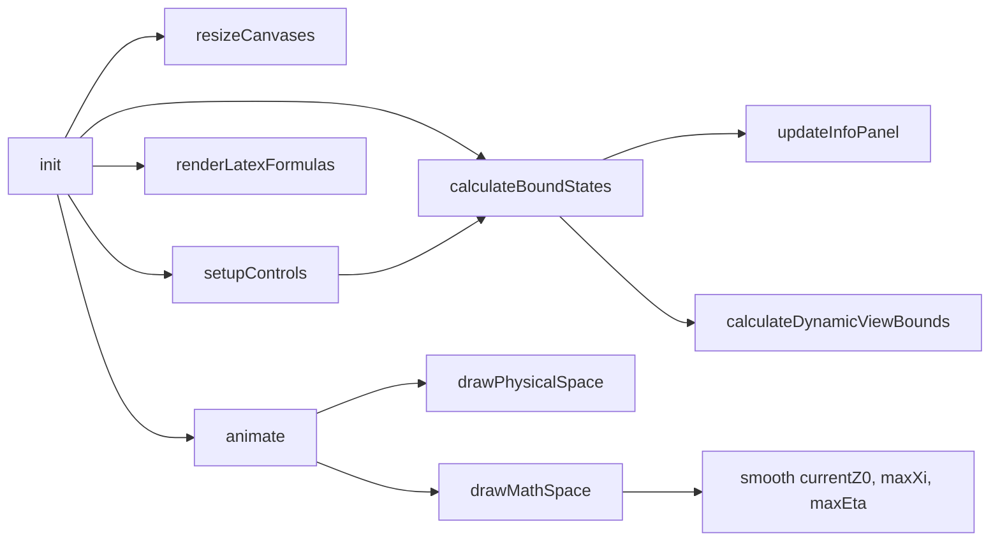

# Bound States Simulation — Physics and Code Review

## Scope

Single file: [simulations/Sims-v2/Bound_states_IG_v1 (1).html](simulations/Sims-v2/Bound_states_IG_v1%20(1).html). It implements a finite square well bound-state solver with two panels (physical space: V(x), E, ψ(x); mathematical space: ξ–η curves and energy circle).

---

## 1. Physics equations and concepts

### Correct

- **Dimensionless variables:** ξ = ka, η = κa with k = √(2mE)/ℏ, κ = √(2m(V₀−E))/ℏ. Relation ξ² + η² = z₀² with z₀ = a√(2mV₀)/ℏ is implemented as `z0 = a * Math.sqrt(V0 / HBAR2_2M)` (line 425).
- **Transcendental equations:** Even η = ξ tan(ξ) and odd η = −ξ cot(ξ) give f(ξ) = ξ²(1+tan²(ξ))−z₀² and ξ²(1+cot²(ξ))−z₀². Implemented correctly in `findIntersection` (lines 528–533).
- **Energy:** E = ℏ²k²/(2m) with k = ξ/a, i.e. `E = HBAR2_2M * k * k` (line 469). Consistent with E = V₀ ξ²/z₀².
- **Wavefunctions:** Inside |x| &lt; a: even ψ = cos(kx), odd ψ = sin(kx). Outside: ψ matched at x = ±a with exponential decay; continuity and parity (even ψ(−x)=ψ(x), odd ψ(−x)=−ψ(x)) implemented correctly (lines 578–602).
- **Penetration depth:** δ = 1/κ (line 471). Correct.
- **Branch ranges:** Even branches [nπ, (n+½)π], odd [(n−½)π, nπ] (n≥1 for odd) match standard finite-well analysis.

### Issue: constant HBAR2_2M = 0.0381

- **Location:** Line 434.
- **Issue:** Comment says “eV·nm² for electron”. For a free electron, ℏ²/(2m) ≈ 3.81×10⁻²⁰ J·m², which in eV·nm² is on the order of ~10¹⁶, not 0.0381. So 0.0381 is ~10¹⁸× smaller than the SI free-electron value.
- **Impact:** With 0.0381, z₀ is large for typical a (nm) and V₀ (eV), so the simulation shows several bound states and behaves well pedagogically. With the SI value, z₀ would be tiny and there would be effectively no bound states.
- **Suggested fix:** Treat 0.0381 as an effective-mass or pedagogical constant. Either: (1) add a short comment (e.g. “effective-mass / pedagogical value so that typical a, V₀ give several bound states; not SI free-electron value”), or (2) use the standard electron value and scale a/V₀ (e.g. use Å and different V₀ range), or (3) make the constant configurable with a documented default.

---

## 2. Numerical methods

### Correct

- **Bisection:** `findIntersection` uses bisection on f(ξ) with 50 iterations and tolerance 1e-10. Sign checks and bracket choice are correct; 0.001 inset from asymptotes avoids tan/cot singularities.
- **Branch loop:** `maxBranches = Math.ceil(z0 / (π/2)) + 2` is sufficient; loop breaks when `xiMin >= z0`. Even and odd branch indexing is correct.
- **Post-solution:** η is derived from ξ via η = ξ tan(ξ) or −ξ cot(ξ), so (ξ,η) lies on the circle; no extra numerical inconsistency.

### No bugs found

No issues with iteration count, tolerances, or edge cases (e.g. single state, first branch).

---

## 3. Architecture and flow

- **Data flow:** Sliders and parity toggle update V₀, a, showEven, then call `calculateBoundStates()`, which recomputes `targetZ0`, `boundStates`, and view bounds. Animation only reads state and draws; smoothing of `currentZ0`, `currentMaxXi`, `currentMaxEta` happens in `drawMathSpace()`.
- **Resize:** Assigning `canvas.width`/`canvas.height` resets the 2D context, then `scale(devicePixelRatio, devicePixelRatio)` is applied once. No scale accumulation; drawing uses `w = canvas.width / devicePixelRatio` (CSS pixel size). Correct.
- **Hover:** `handleMathCanvasHover` uses `getBoundingClientRect()` and compares to points in the same CSS-pixel space; distance threshold 15 is consistent with plot coordinates.

### No architectural bugs found

---

## 4. Front-end and rendering

### Physical panel

- **Axes and potential:** V(x) drawn as step at ±a, well from −a to a; x-range ±3a; vMin/vMax include 0 and V₀. Correct.
- **Well fill:** `fillRect(toScreenX(-a), toScreenY(V0), width, height)` with positive height. Correct.
- **Energy levels and ψ:** Horizontal lines at E and ψ offset by `waveScale = V0 * 0.12`; wavefunctions continuous at ±a and parity-correct. Correct.
- **No rendering bugs identified** (no clipping, wrong sign, or inverted axes).

### Math panel

- **Quarter circle:** ξ = z₀ cos(θ), η = z₀ sin(θ) for θ ∈ [0, π/2]. Correct.
- **Curves and asymptotes:** Even asymptotes at (n+½)π, odd at nπ; curves drawn per branch with small step. Correct.
- **Smoothing:** `currentZ0`, `currentMaxXi`, `currentMaxEta` approach targets with factor 0.08; avoids jumpy view when parameters change.

### UX / labeling

- **State index vs quantum number:** Energy list and hover show “E0”, “E1”, “n=0”, “n=1”. These are 0-based state indices for the selected parity, not the usual “number of nodes” quantum number. Risk of confusion for users who expect “n = 1” for ground state.
- **Suggested fix:** In the hover tooltip, use “state 0” / “state 1” or “E₀, E₁” and optionally add a short note in the About section that “N” is the number of bound states for the selected parity (even or odd).

---

## 5. Bugs and suggested fixes (summary)

| #   | Severity | Description                                                                                                | Location                                   | Suggested fix                                                                                                                                         |
| --- | -------- | ---------------------------------------------------------------------------------------------------------- | ------------------------------------------ | ----------------------------------------------------------------------------------------------------------------------------------------------------- |
| 1   | Medium   | **HBAR2_2M = 0.0381** does not match SI free-electron ℏ²/(2m) in eV·nm²                                    | Line 434                                   | Document as effective-mass/pedagogical constant, or use standard value with adjusted a/V₀, or make constant configurable with a clear default comment |
| 2   | Low      | **State index vs quantum number:** “n=0”, “n=1” suggest quantum number n                                   | Hover label ~line 769, energy list 556–557 | Use “state 0/1” or “E₀/E₁” in hover; optionally add one sentence in About that N is the count for the chosen parity                                   |
| 3   | Low      | **Zero bound states:** When N = 0 (e.g. small z₀ or only one parity), energy list is empty with no message | `updateInfoPanel` 531–547                  | When `boundStates.length === 0`, show a single line e.g. “No bound states for this parity” in the energy list                                         |

No other physics, numerical, or rendering bugs were found. The simulation is consistent and correct aside from the constant documentation and the minor UX items above.

---

## 6. Optional improvements (non-bugs)

- **Accessibility:** Parity buttons could use `aria-pressed` and the reset button `aria-label` for screen readers (similar to [A(k)-vs-k-plot-BUGS-REPORT.md](simulations/Sims-v2/A(k)-vs-k-plot-BUGS-REPORT.md)).
- **Stability:** If in the future V₀ or a are allowed to be very large, the bisection could hit floating-point limits near asymptotes; current ranges (V₀ ≤ 200 eV, a ≤ 2 nm) are fine.
- **Formula panel:** The About section shows ξ = ka and η = κa; adding the relation ξ²+η² = z₀² would reinforce the circle in the math panel.

---

## 7. Conclusion

- **Physics:** Equations for z₀, ξ, η, transcendental equations, wavefunctions, E, κ, and δ are correct. Only issue is documentation/choice of **HBAR2_2M**.
- **Numerics:** Bisection and branch logic are correct; no stability or tolerance issues found.
- **Architecture:** Clear separation of controls → `calculateBoundStates` → draw; resize and hover coordinates are consistent.
- **Rendering:** Physical and math panels render correctly; no physics or drawing bugs in the visuals.

**Recommended actions:** (1) Document or adjust HBAR2_2M; (2) clarify state-index labeling and zero-state message; (3) optionally add the small UX/accessibility improvements above.